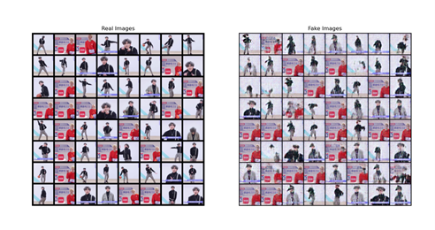

# gan_kun
南邮人工智能中的深度学习任选课作业
The assignment of the elective course on deep learning in artificial intelligence at Nanjing University of Posts and Telecommunications 

本人资深ikun，为爱发电
已上传一个生成蔡徐坤的简单模型，效果如下：
I'm a die-hard IKUN and do this out of love.
I've uploaded a simple model to generate Cai Xukun, and the effect is like this:  

# 使用说明

将文件全部下载，数据集解压到运行目录，运行train.py即可。
Download the entire file, unzip the dataset into the running directory, and run train.py to start training. 
如果需要修改参数，在train.py最上面的config进行修改。
If you need to modify parameters, make the changes at the top of the train.py file in the config section. 
也可以使用自己的数据集，需要和原来格式一样 即：
You can also use your own dataset, which should be in the same format as the original one, i.e. :

--root dir

>--train.py

>--data

>>--user_datasets
>>>1.jpg
>>>2.jpg
>>>...
